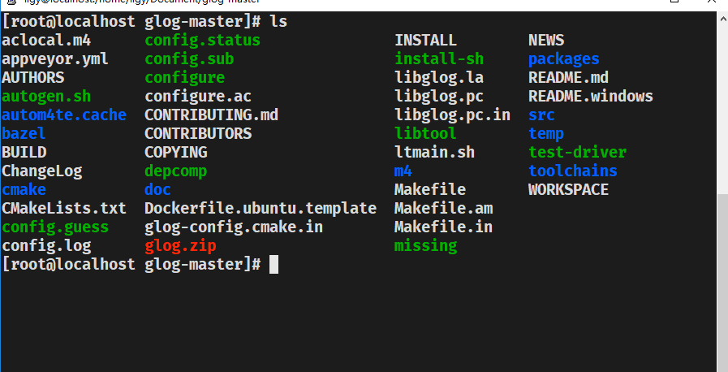
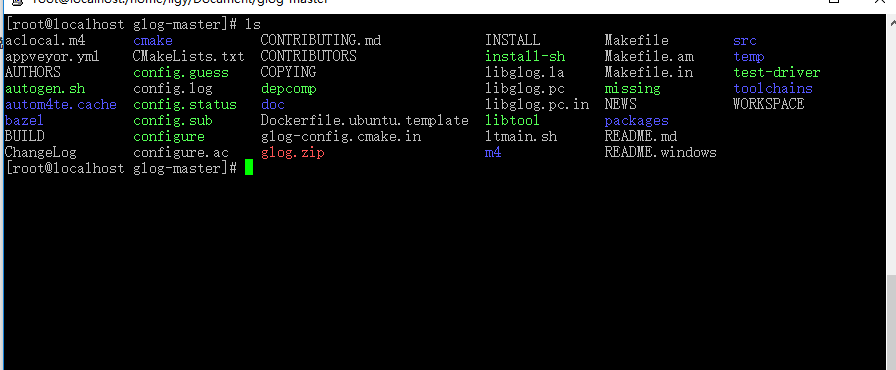

# 文件说明

`putty配置注册表.reg`是window下的注册脚本文件，此注册表内包含了对putty文本字体,以及配色的修改从而达到画面和颜色都美观的目的


# 效果展示

下面给出配置之前与配置之后的对比


这是改过后的：



这是默认的




# 配色修改

主要的配色方案在注册表内也已经体现，是一种颜色配色改为如下

```
"Colour0"="217,216,216"
"Colour1"="217,216,216"
"Colour2"="28,28,28"
"Colour3"="28,63,149"
"Colour4"="28,28,28"
"Colour5"="231,231,232"
"Colour6"="115,113,113"
"Colour7"="115,113,113"
"Colour8"="251,38,8"
"Colour9"="251,38,8"
"Colour10"="167,226,46"
"Colour11"="167,226,46"
"Colour12"="102,217,238"
"Colour13"="102,217,238"
"Colour14"="0,157,220"
"Colour15"="0,157,220"
"Colour16"="255,85,255"
"Colour17"="255,85,255"
"Colour18"="255,210,4"
"Colour19"="255,210,4"
"Colour20"="217,216,216"
"Colour21"="255,255,255"
```


# putty字体

字体设为`Fira Mono`,字形为粗体，大小为14号（如果你的电脑屏幕较小可以设为12号）


# 安装方法

双击REG文件即可将其中的数据导入到注册表当中。