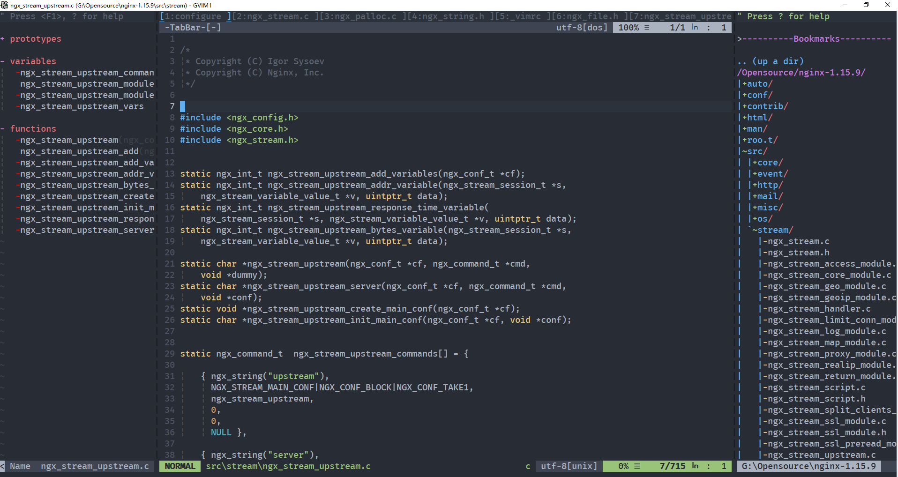

# window 下安装vim

## 详细安装

1. 官网下载`vim8.1.exe`

   ```
   https://www.vim.org/download.php#pc
   ```

2. 安装并配置环境变量

   双击安装，按照步骤一步步安装，建议不要安装在C盘

   配置环境变量的方法，以下凡是配置环境变量方式也行同：

   > > 我的电脑------->属性------------>高级--------->环境变量----->PATH----->添加

3. 安装Git,

   Vundle基于git架构，每一个插件都是一个项目的Repository，通过Vundle可以用简单的指令，一键安装/更新/删除所有插件。

   - 下载地址：

   ```
   https://github.com/git-for-windows/git/releases/download/v2.21.0.windows.1/Git-2.21.0-64-bit.exe
   ```

   - 安装

4. 配置curl脚本

   在Windows下还需要建立一个Curl脚本用于Vundle的远程链接。在Git的路径下e:\Program Files\Git\cmd\新建一个空文本文件，改名为curl.cmd，编辑内容为

   ```
   @rem Do not use "echo off" to not affect any child calls.
   @setlocal
    
   @rem Get the abolute path to the parent directory, which is assumed to be the
   @rem Git installation root.
   @for /F "delims=" %%I in ("%~dp0..") do @set git_install_root=%%~fI
   @set PATH=%git_install_root%\bin;%git_install_root%\mingw\bin;%git_install_root%\mingw64\bin;%PATH%
   @rem !!!!!!! For 64bit msysgit, replace 'mingw' above with 'mingw64' !!!!!!!
    
   @if not exist "%HOME%" @set HOME=%HOMEDRIVE%%HOMEPATH%
   @if not exist "%HOME%" @set HOME=%USERPROFILE%
    
   @curl.exe %*
   ```

5. 安装bundle

   ```
   git clone https://github.com/gmarik/Vundle.vim.git D:\Program Files\Vim\vimfiles\bundle\Vundle.vim
   ```

   出现的问题：

   ```
   error:1407742E:SSL routines:SSL23_GET_SERVER_HELLO:tlsv1 alert protocol version
   ```

   git版本过低，安装最近版本就可以了

6. ctags
   - 到<http://ctags.sourceforge.net/>下载最新的windows版
   - 在环境变量中添加ctags.exe所在目录
   - 具体的ctags配置这里不说明，详细看vimrc文件，一些插件都用到了ctags，这个插件很重要
   - 把光标移到变量名或函数名上，然后按下“Ctrl+]”，这样就能直接跳到这个变量或函数定义的源文件中;用“Ctrl+t”可以退回原来的地方

7. cscope
   - 下载地址： http://sourceforge.net/project/showfiles.php?group_id=196604&package_id=232374
   - 在环境变量中添加cscope.exe所在目录

8. 安装自动弹出vim-autocomplpop，

   - 下载：http://www.vim.org/scripts/script.php?script_id=1879 

   - 先解压：unzip [vim](https://www.baidu.com/s?wd=vim&tn=24004469_oem_dg&rsv_dl=gh_pl_sl_csd)-autocomplpop.zip

   - 解压后的文件拷贝到`Vim\vimfiles`相应的文件中

9. 安装补全omnicppcomplete

   - 下载：http://www.vim.org/scripts/script.php?script_id=1520

   - 先解压：unzip omnicppcomplete-0.41.zip

   - 解压后的文件拷贝到`Vim\vimfiles`相应的文件中

   - 添加相应的配置到vimrc中

     ```toml
     #这里vim报语法错误，不知道是不是版本不支持，因此将语法出错的行注释掉了
     "let OmniCpp_GlobalScopeSearch=1 
     let OmniCpp_NamespaceSearch=1
     let OmniCpp_DisplayMode=1
     let OmniCpp_ShowScopeInAbbr=0
     "let OmniCpp_ShowPrototypeInAbbr=1 
     "let OmniCpp_ShowAccess=1 
     "let OmniCpp_MayCompleteDot=1 
     let OmniCpp_MayCompleteArrow=1
     let OmniCpp_MayCompleteScope=1
     ```

10. 将编写vimrc文件，执行安装

    打开命令行wind+R------>输入cmd--------->打开vim------>执行bundle开始启动安装

> >参考链接：https://blog.csdn.net/zxy9602/article/details/79439257


## 傻瓜式安装

1. 解压压缩包文件`gvim_windows.rar`

2. 得到三个目录

   ```
   ---安装目录
   ---下载安装包
   ---用户
   ```

3. 将安装目录的VIM文件放到要安装的目录下，例如`D:\Program Files`

4. 将用户目录下的文件拷贝操用户的目录`C:\Users\usename`

5. 设置环境变量

   - vim环境变量：`D:\Program Files\Vim\vim81`
   - git环境变量：`D:\Program Files\Vim\Git\cmd`
   - ctags环境变量：`D:\Program Files\Vim\ctags58\ctags58`
   - cscope环境变量: `D:\Program Files\Vim\cscope-15.7`

6. 执行安装

   打开命令行wind+R------>输入cmd--------->打开vim------>执行bundle开始启动安装


## 效果预览

